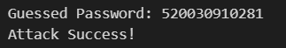
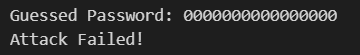

# Assignment 12

## Part 1：XSS

（a）Discuss what an attacker could do to snoop on another user’s messages. What specially crafted messages could Mallory have sent to steal this user’s account verification code?

**Solution:** 

```html
Mallory: Hello  XSS?
```

+ Firstly, Mallory sent `Hello  XSS?`.

This makes a request to `attacker.com`, sending the account verification code as part of the URL.

（b）Keeping in mind the attack you constructed in the previous part, what is a defense that can prevent against it?

**Solution:** 

Content Security Policy. We can specify the sources/domains that are allowed to be used for the \ tag or specify the sources to block. This will block \ tags with invalid sources and will stop the image from loading. 


## Part 2：Verification Timing Attack

### Verification Timing Attack原理

+ 场景举例：当Client将密码发送给Server时，Server会进行验证。

+ Vulnerability：验证方式为按位比较，一旦有一位不同，就会返回验证不通过。故验证时延会不同。

  ```python
  def verify(input_pwd):
  	for i in range(len(real_pwd)):
  		if input_pwd[i] != real_pwd[i]:
  			return false
  		return true
  ```

+ 攻击方法：
  1. 随机生成一个密码发给Server，获取服务器响应时间。
  2. 从第一位开始，尝试所有情况，如果验证时延不变，则依旧为错，直到验证时延变长了一点，说明服务器比较两个密码的时候第一位是一样的。
  3. 下一位重复以上操作，直到密码完全吻合。这样就得到了合法的密码。


### 代码模拟Verification Timing Attack

Server类：

+ 为了方便代码编写，这里使用纯数字密码。

```python
# Server类
class Server: 
    def __init__(self):
        # 真实密码
        self.real_pwd = "520030910281" # 12位

    def verify(self, input_pwd):
        for i in range(len(self.real_pwd)):
            if self.real_pwd[i] != input_pwd[i]:
                # 模拟验证时延
                return i
        # 最长验证时延
        return len(self.real_pwd)
```

攻击过程：

```python
# 初始化Server
server = Server()

def timing_attack(server):
    pwd = '0000000000000000' # 16位，多数情况下的密码最长位数，比如微信、wifi密码
    last_passed = -1 # 上一次的正确位数
    for i in range(len(pwd)):
        try_pwd = pwd
        max_passed = last_passed # 本轮最大猜对位数
        for j in range(10):
            # 第i位为j的尝试
            try_list = list(try_pwd)
            try_list[i] = str(j)
            try_pwd = ''.join(try_list)
            # 验证得到时延
            delay = server.verify(try_pwd)
            # 如果这一位猜对得到本轮最大猜对位数
            if delay > i:
                max_passed = i
                break
        # 如果本轮猜对位数大于上一轮说明还没有猜完
        if last_passed < max_passed:
            last_passed = max_passed
            pwd = try_pwd
        else:
            # 如果本轮猜对位数等于上一轮说明已经猜完
            pwd = pwd[0: max_passed + 1]
            break
    print("Guessed Password:", pwd)
    if pwd == server.real_pwd:
        print('Attack Success!')
    else:
        print('Attack Failed!')

# 攻击
timing_attack(server)
```

攻击结果：




### Verification Timing Attack防御措施

+ 有多种方法，例如：
  + 每一位都比较完后再响应。
  + 返回前等待一个随机时延后再响应。
  + 将收到的密码和真实密码依次哈希后再比较。

等待随机时延方式的代码实现如下：

```python
# Safe_Server类：利用随机时延抵御验证时间攻击
class Safe_Server: 
    def __init__(self):
        # 真实密码
        self.real_pwd = "520030910281" # 12位

    def verify(self, input_pwd):
        for i in range(len(self.real_pwd)):
            if self.real_pwd[i] != input_pwd[i]:
                # 验证时延 + 随机等待一个时延
                return i + random.randint(16 - i, 32 - i)
        # 最长验证时延
        return len(self.real_pwd)
```

攻击过程：

```python
# 随机种子
random.seed(520030910281)

# 初始化服务器
safe_server = Safe_Server()

# 尝试攻击
timing_attack(safe_server)
```

攻击结果：

